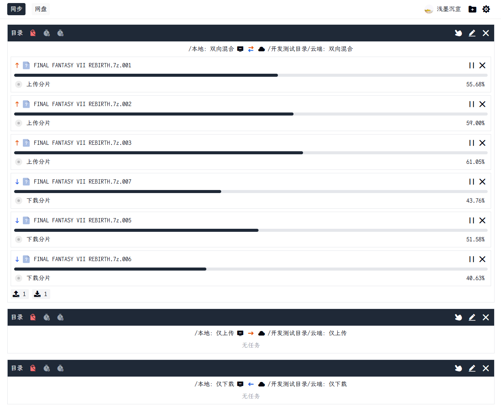
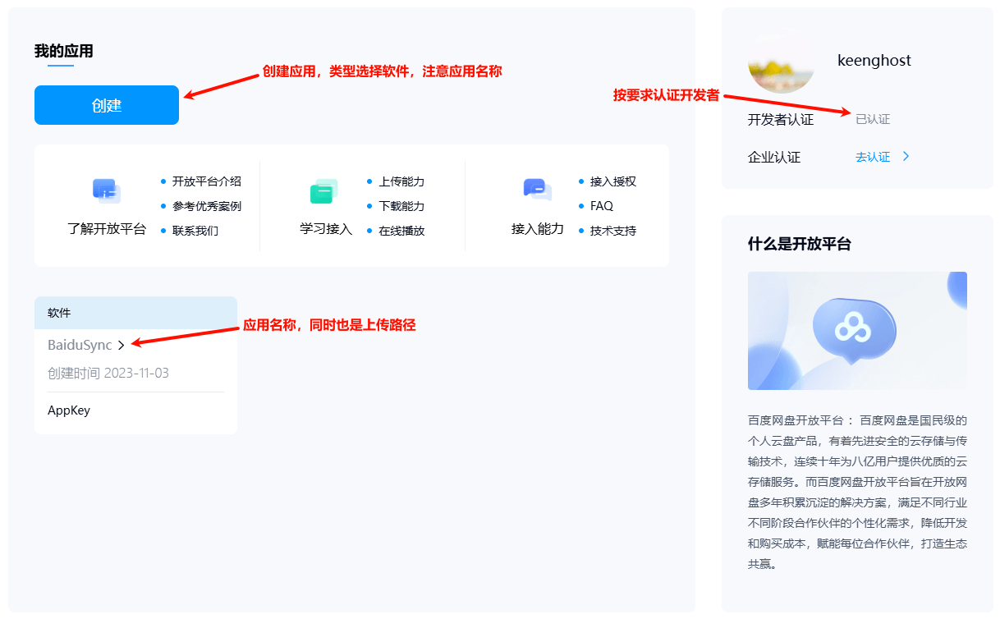
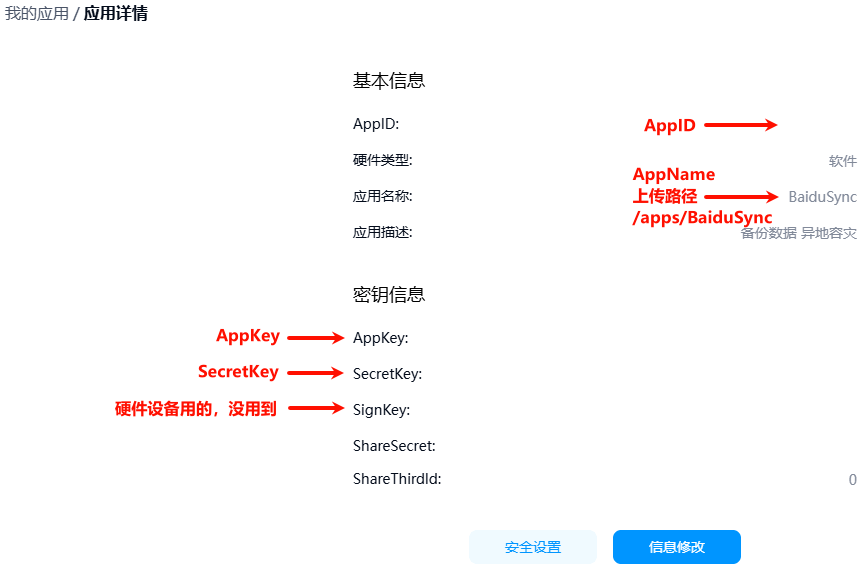

<h1 align="left"> Baidu Netdisk Node</h1>

> 基于百度网盘官方 API 的 node 封装 📦
>
> 🎯 欢迎提出 issue 和 PR，一起让这个项目变得更好！

[](https://nodejs.org/)
[](https://pnpm.io/)
[](https://hub.docker.com/r/keenghost/baidu-netdisk-sync)
[](LICENSE)
[](https://github.com/keenghost/BaiduNetdiskNode/commits/)
[](https://github.com/keenghost/BaiduNetdiskNode/stargazers)

## 📚 子仓库

### 🔌 api

单纯封装 API 接口, 简单传参即可完成请求, 包含成功响应时的业务错误处理。
了解更多: [baidu-netdisk-api](packages/api/README.md)

### 🛠️ sdk

再次基于 baidu-netdisk-api 进行封装, 提供 Netdisk 对象, 合并上传、下载等复杂流程, 并提供加密。
了解更多: [baidu-netdisk-sdk](packages/sdk/README.md)

### 🚀 srv

百度网盘 Node 实现, 目前支持同步任务。未来将支持更多功能, 逐渐趋于完整的客户端。

### 🖥️ web

baidu-netdisk-srv 的 web 端 UI, 基于 vite + vue3 实现。

### 🔑 xth

单独部署的远程认证服务, 用于解决在用户没有开发者身份时的授权问题。

## 🚀 部署

### 🐳 Docker部署 (sync)

```bash
docker run -d --restart=always \
  -v /放配置的主机目录:/baidu-netdisk-srv/runtime \
  -v /下载的主机目录:/bddownloads \
  -v /同步的主机目录:/随意容器内目录 \
  -p 7777:7777 \
  -e WEB_USER=用户名 \
  -e WEB_PASS=密码 \
  -e WEB_PORT=7777 \
  -e TOKEN_SECRET=自定义密钥 \
  -e TZ=Asia/Shanghai \
  keenghost/baidu-netdisk-sync:latest
```

### 🐳 Docker部署 (auth)

```bash
docker run -d --restart=always \
  -v /主机目录/runtime:/baidu-netdisk-xth/runtime \
  -p 8888:8888 \
  -e APP_ID=开发者APP_ID \
  -e APP_KEY=开发者APP_KEY \
  -e APP_NAME=开发者APP_NAME \
  -e SECRET_KEY=开发者SECRET_KEY \
  -e LISTEN_PORT=8888 \
  -e TZ=Asia/Shanghai \
  keenghost/baidu-netdisk-auth:latest
```

### 💻 源代码部署 (sync)

> ⚠️ 确保已安装 node 环境, 同时已安装 pnpm.

```bash
git clone https://github.com/keenghost/BaiduNetdiskNode.git BaiduNetdiskNode
cd BaiduNetdiskNode && pnpm i && pnpm build srv web
cd packages/srv/dist && pnpm start
```

这会启动 BaiduNetdiskSync 服务并监听 7777 端口, 访问 http://127.0.0.1:7777 即可访问 Web 端 UI。

**环境变量:**

| 变量名         | 说明                    | 默认值   |
| -------------- | ----------------------- | -------- |
| `WEB_USER`     | 自定义的用户名          | -        |
| `WEB_PASS`     | 自定义的密码            | -        |
| `WEB_PORT`     | Web 端 UI 监听的端口    | 7777     |
| `TOKEN_SECRET` | 自定义的 Token 加密密钥 | 随机生成 |
| `TZ`           | 时区                    | -        |

> 📝 配置文件位于 `packages/srv/dist/runtime/config.json`

### 💻 源代码部署 (auth)

> ⚠️ 确保已安装 node 环境, 同时已安装 pnpm.

```bash
git clone https://github.com/keenghost/BaiduNetdiskNode.git BaiduNetdiskNode
cd BaiduNetdiskNode && pnpm i && pnpm build xth
cd packages/xth/dist && pnpm start
```

这会启动 BaiduNetdiskAuth 服务并监听 8888 端口, BaiduNetdiskSync 认证时可填入 http://127.0.0.1:8888。

**环境变量:**

| 变量名        | 说明                  | 默认值 |
| ------------- | --------------------- | ------ |
| `APP_ID`      | 百度开发者 APP_ID     | -      |
| `APP_KEY`     | 百度开发者 APP_KEY    | -      |
| `APP_NAME`    | 百度开发者 APP_NAME   | -      |
| `SECRET_KEY`  | 百度开发者 SECRET_KEY | -      |
| `LISTEN_PORT` | 服务监听的端口        | 8888   |
| `TZ`          | 时区                  | -      |

> 📝 配置文件位于 `packages/xth/dist/runtime/config.json`

## 🛠️ 调试

### 🔄 sync

```bash
git clone https://github.com/keenghost/BaiduNetdiskNode.git BaiduNetdiskNode
cd BaiduNetdiskNode && pnpm i && pnpm dev srv web
```

访问 http://127.0.0.1:7777 即可访问 web 端 ui。

### 🔐 auth

```bash
git clone https://github.com/keenghost/BaiduNetdiskNode.git BaiduNetdiskNode
cd BaiduNetdiskNode && pnpm i && pnpm dev xth
```

访问 http://127.0.0.1:8888/api/... 即可调试 api。

## 📸 预览



## 📈 进度

### 已完成

- ✅ 网盘API封装 (基础接口)
- ✅ 网盘SDK封装 (合并上传、下载等复杂流程，支持加解密与多线程)
- ✅ 文件夹同步 (支持单向上传、单向下载、双向混合)
- ✅ 定时任务 (定时开始和停止)
- ✅ 网盘功能 (下载文件) (下载至服务器，一般用于挂机下载)

### 待完成

- ⏳ 网盘功能 (上传文件) (从网页上传)
- ⏳ 网盘功能 (下载文件) (从网页下载)
- ⏳ 网盘功能 (复制文件/文件夹)
- ⏳ 网盘功能 (移动文件/文件夹)
- ⏳ 网盘功能 (重命名文件/文件夹)
- ⏳ 网盘功能 (删除文件/文件夹)
- ⏳ 日志功能 (同步文件记录、已完成的下载等)
- ⏳ 桌面客户端 (貌似意义不大，用官方的就行)

## 📝 如何成为百度网盘开发者

1. 前往 [百度网盘开发者平台](https://pan.baidu.com/union/console/applist) 👉
2. 开发者认证: 去认证，申请成为个人开发者 (可能不需要这一步也能创建应用)
3. 创建应用，注意选择类型为**软件**
4. 最后在应用信息里得到 AppName、AppID、AppKey、SecretKey

|                                                                    |                                                                  |
| :----------------------------------------------------------------: | :--------------------------------------------------------------: |
|  |  |

## 💡 题外话

如果你主系统使用的是群晖, 毫无疑问直接使用 CloudSync 即可。

我用的 UNRAID + 黑群晖, 硬盘共享方面始终不尽人意:

- 网络共享目录不让选择
- 6.2 能使用 9p 挂载但没法实时监控文件变化
- CloudSync 加密逻辑是先将整个文件加密保存到本地再上传，遇到大文件时很占用空间
