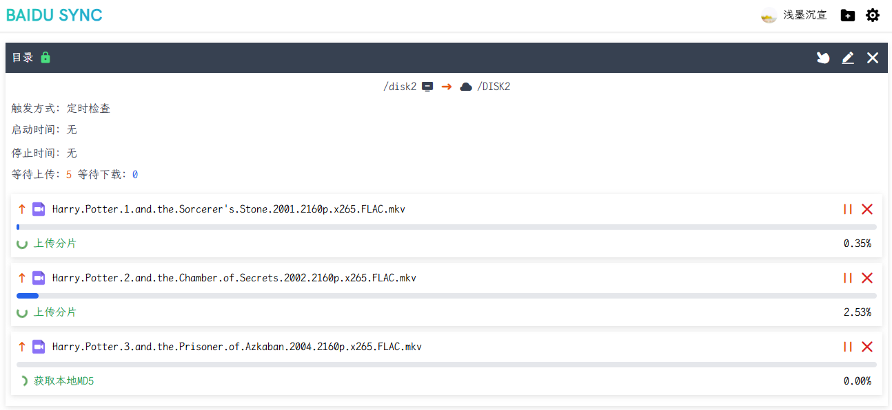

<div align="center">
    
</div>

# Baidu Netdisk Node

基于百度网盘官方 API 的 node 封装.

> 欢迎提出 issue 和 PR.

<p align="center">
    
    
    <a href="https://hub.docker.com/r/keenghost/baidu-netdisk-sync"></a>
    <br>
    
    
    
</p>

## 子仓库

- ### api

  单纯封装 API 接口, 简单传参即可完成请求, 包含成功响应时的业务错误处理.
  了解更多: [baidu-netdisk-api](packages/api/README.md)

- ### sdk

  再次基于 baidu-netdisk-api 进行封装, 提供 Netdisk 对象, 合并上传、下载等复杂流程, 并提供加密.
  了解更多: [baidu-netdisk-sdk](packages/sdk/README.md)

- ### srv

  百度网盘 Node 实现, 目前支持同步任务. 未来将支持更多功能, 逐渐趋于完整的客户端.

- ### web

  baidu-netdisk-srv 的 web 端 UI, 基于 vite + vue3 实现.

- ### xth

  单独部署的远程认证服务, 用于解决在用户没有开发者身份时的授权问题.

## 部署

- ### Docker部署 (sync)

  ```
  docker run -d --restart=always -v /主机目录/runtime:/baidu-netdisk-srv/runtime -v /同步的主机目录:/随意容器内目录 -p 7777:7777 -e WEB_USER=用户名 -e WEB_PASS=密码 -e WEB_PORT=7777 -e TOKEN_SECRET=自定义密钥 keenghost/baidu-netdisk-sync:latest
  ```

- ### Docker部署 (auth)

  ```
  docker run -d --restart=always -v /主机目录/runtime:/baidu-netdisk-xth/runtime -p 8888:8888 -e APP_ID=开发者APP_ID -e APP_KEY=开发者APP_KEY -e APP_NAME=开发者APP_NAME -e SECRET_KEY=开发者SECRET_KEY -e LISTEN_PORT=8888 keenghost/baidu-netdisk-auth:latest
  ```

- ### 源代码部署 (sync)

  > 确保已安装 node 环境, 同时已安装 pnpm.

  ```
  git clone https://github.com/keenghost/BaiduNetdiskNode.git BaiduNetdiskNode
  cd BaiduNetdiskNode && pnpm i && pnpm build srv web
  cd packages/srv/dist && pnpm start
  ```

  这会启动 BaiduNetdiskSync 服务并监听 7777 端口, 访问 http://127.0.0.1:7777 即可访问 Web 端 UI.
  环境变量:

  - WEB_USER: 自定义的用户名
  - WEB_PASS: 自定义的密码
  - WEB_PORT: 指定 Web 端 UI 监听的端口, 默认 7777
  - TOKEN_SECRET: 自定义的 Token 加密密钥, 默认随机生成

  > 配置文件位于 packages/srv/dist/runtime/config.json

- ### 源代码部署 (auth)

  > 确保已安装 node 环境, 同时已安装 pnpm.

  ```
  git clone https://github.com/keenghost/BaiduNetdiskNode.git BaiduNetdiskNode
  cd BaiduNetdiskNode && pnpm i && pnpm build xth
  cd packages/xth/dist && pnpm start
  ```

  这会启动 BaiduNetdiskAuth 服务并监听 8888 端口, BaiduNetdiskSync 认证时可填入 http://127.0.0.1:8888.
  环境变量:

  - APP_ID: 百度开发者 APP_ID
  - APP_KEY: 百度开发者 APP_KEY
  - APP_NAME: 百度开发者 APP_NAME
  - SECRET_KEY: 百度开发者 SECRET_KEY
  - LISTEN_PORT: 指定服务监听的端口, 默认 8888

  > 配置文件位于 packages/xth/dist/runtime/config.json

## 调试

- ### sync

  ```
  git clone https://github.com/keenghost/BaiduNetdiskNode.git BaiduNetdiskNode
  cd BaiduNetdiskNode && pnpm i && pnpm dev srv web
  ```

  访问 http://127.0.0.1:7777 即可访问 web 端 ui.

- ### auth

  ```
  git clone https://github.com/keenghost/BaiduNetdiskNode.git BaiduNetdiskNode
  cd BaiduNetdiskNode && pnpm i && pnpm dev xth
  ```

  访问 http://127.0.0.1:8888/api/... 即可调试 api.

## 预览

<div align="center"></div>

## 题外话

如果你主系统使用的是群晖, 毫无疑问直接使用 CloudSync 即可.

我用的 UNRAID + 黑群晖, 硬盘共享方面始终不尽人意, 网络共享目录不让选择, 6.2 能使用 9p 挂载但没法实时监控文件变化, 加之 CloudSync 加密逻辑是先将整个文件加密保存到本地再上传, 遇到大文件时很占用空间.
